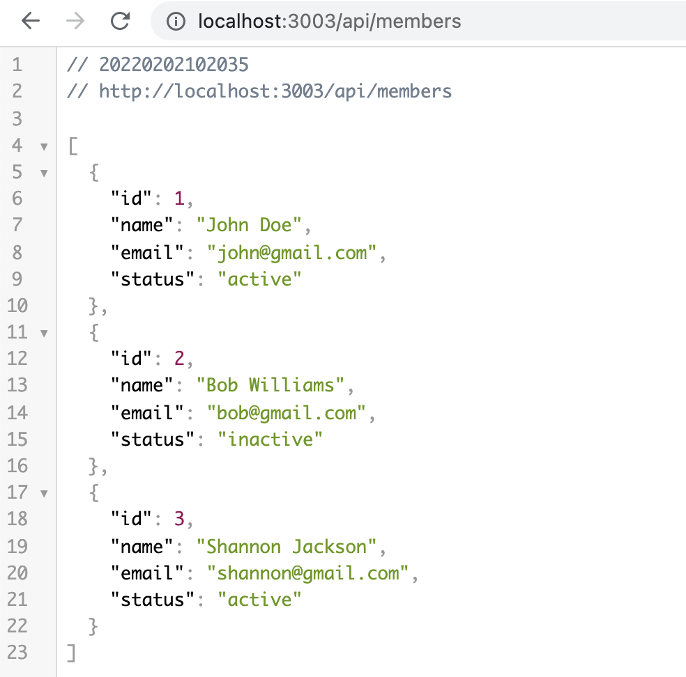

# Express Crash Course demo app

  

I built an API with Express for the first time following along with Brad Traversy's [Express Crash Course tutorial](https://www.youtube.com/watch?v=L72fhGm1tfE).

## Summary

Users can view, create, update, and delete members of an organization through the Members API. This is a simple CRUD API built for the sake of exposing myself to Node.js and Express.

I learned how to build out and organize endpoints with Express.

I also learned how to inject middleware into an Express API by logging the URL and a timestamp for each request.
